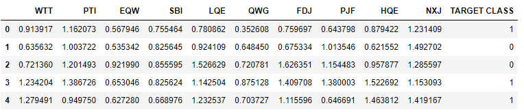
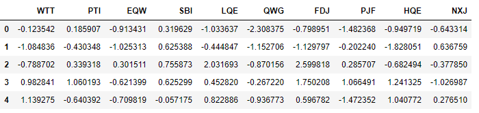
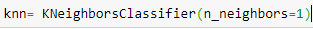
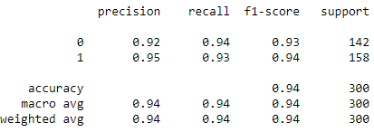
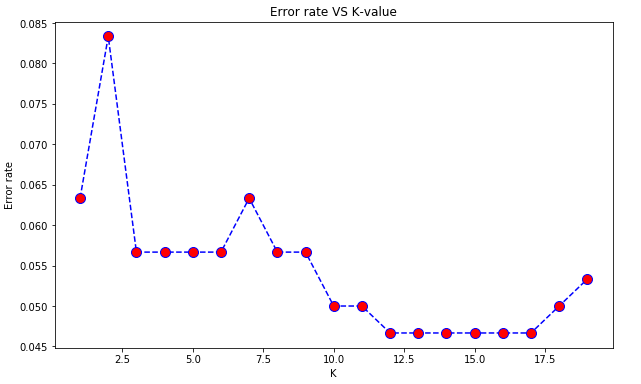
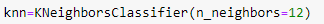
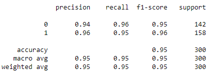

# KNN-algorithm-for-unknown-dataset
This is a classification problem, where I have worked on a data-set where the names of the labels are unknown(names are replaced with some random value). I have used K-nearest neighbor algorithm to predict the values for the target data. 

Now let me explain the process,

First of all I have implemented a dataset where the labels are hidden(or replaced with some random value),
 

  

Then I have scaled the data using "fit" and "transform" methods and remove the "TARGET CLASS" from the dataset.

 

  

Then for experimental purposes I have taken K=1 and made the predictions,

 
 

 
And here is the prediction result that I got from the classification matrix,
 
 

 

Then I have used <b>"Elbow Method"</b> to find the best <b>"K"</b> value.

 
After applying the Elbow method I got this graph,
 
 

 
From the above diagram you can see that error rate is min for values like 12 or 17.7 . I am choosing 12 to impliment the algo.
 
 

 
 
And I got this classification matrix,
 
 

 
 
As you can see the prediction values are much better than the previous one.
 
 
Thank you for visiting and please let me know if you have any queries. 
